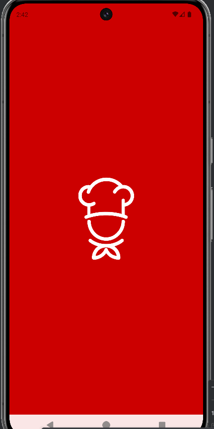
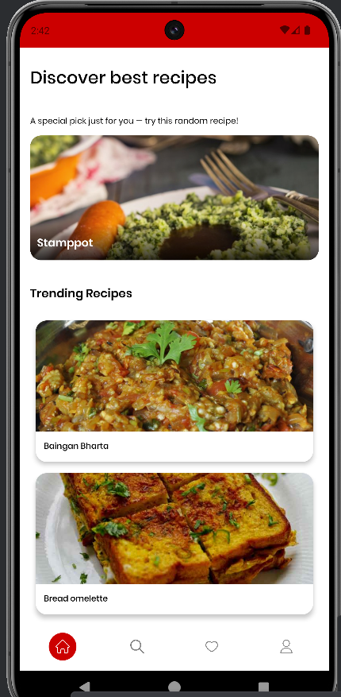
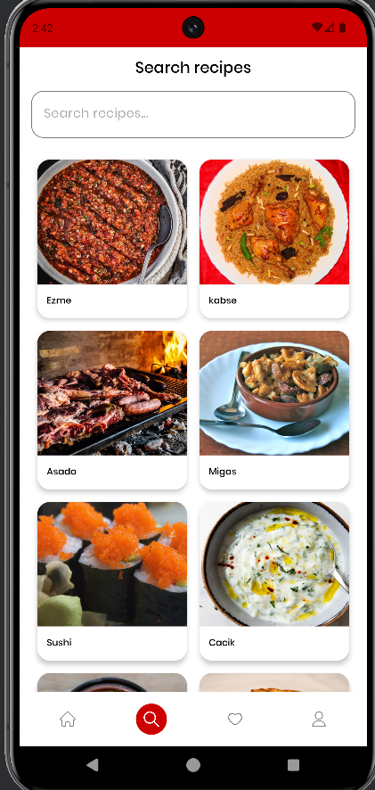
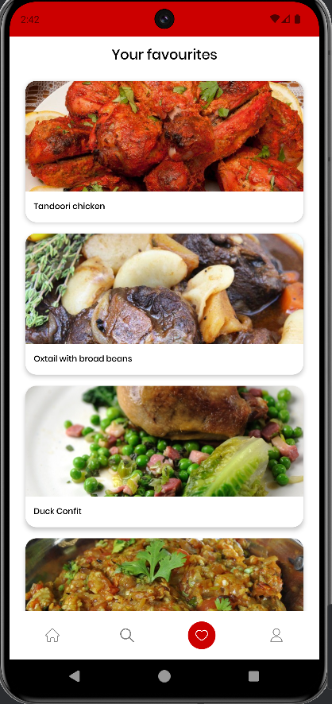
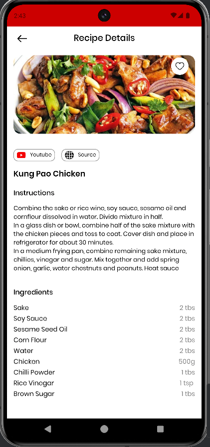
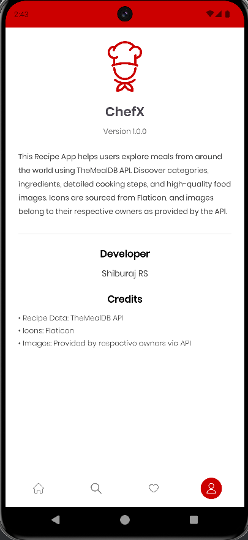

# 📱 ChefX - Android
A modern online/offline recipe app built with Android Kotlin that lets users explore thousands of meals, categories, and cooking instructions powered by TheMealDB API. The app allows saving favorite recipes for offline access, making it easy to cook anytime, anywhere.

---


## 🛠️ Tech Stack
**Language:** Kotlin  
**UI:** XML  
**Architecture:** MVVM / Clean Architecture  
**Async:** Coroutines + Flow  
**DI:** Hilt  
**Network:** Retrofit  
**Database:** Room
**Other:** Glide

---

## 📸 Screenshots
| Screen 1 | Screen 2 | Screen 3 |
|---------|----------|----------|
|  |  |  |
|  |  |  |

---

## 🏗️ Project Structure (Clean Architecture)
```
app/
├── core/
│   ├── module/               # Base classes, navigation helpers, common utilities
│   │   ├── BaseActivity
│   │   └── BundleArguments
│   │
│                    
│
├── data/
│   ├── local/                # Room database layer (Offline storage)
│   │   ├── dto/              # Local DB entities
│   │   ├── RecipeDao
│   │   └── RecipeDatabase
│   │
│   ├── remote/               # API layer (Online data fetching)
│   │   ├── dto/              # API response models
│   │   └── ApiService
│   │
│   └── di/                   # Dependency injection modules
│       └── DatabaseModule
│
├── domain/
│   ├── repository/           # Repository interfaces + business logic layer
│   │   ├── RecipeRepository
│   │   └── RecipeDatabaseRepository
│   │
│   
│
├── presentation/
│   ├── activity/             # Activities (UI entry points)
│   │   └── DashboardActivity
│   │
│   ├── fragment/             # Screens / UI pages (XML or Compose)
│   │
│   ├── adapters/             # RecyclerView adapters
│   │
│   └── components/           # Custom UI components
│
├── utils/
│   ├── ActivityUtils
│   ├── UiState               # Sealed classes for loading/error/success
│   └── MyAppGlideModule      # Glide setup
│
├── ChefXApplication          # Application-level setup (Hilt, global things)
└── MainActivity              # App entry point

```

---

## ⚙️ Setup & Installation
### 1. Clone the repo
```bash
git clone https://github.com/shiburajrs/ChefX-android.git
```

### 2. Open in Android Studio
- File → Open → Select project folder

### 3. Build the project
- Android Studio will auto sync Gradle  
- Run on emulator or real device

---

## 🤝 Contributing
1. Fork the project  
2. Create a feature branch  
3. Commit your changes  
4. Create a Pull Request  

---

## 📄 License
This project is licensed under the MIT License – feel free to use and modify.


---

## 👨‍💻 Author
Shiburaj RS  
